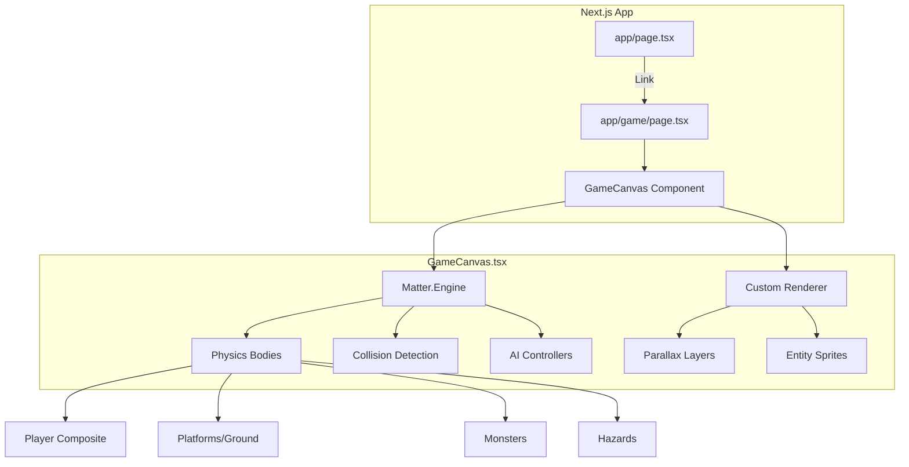

# GigaPotato - "Kilo Man" Project Summary

## Overview
**Kilo Man** is a 2D side-scrolling platformer game built as a Next.js web application using React and Matter.js physics engine.

## Tech Stack
| Layer | Technology |
|-------|------------|
| Framework | Next.js 16.1.2 |
| UI Library | React 19.2.3 |
| Physics Engine | Matter.js 0.20.0 |
| Styling | Tailwind CSS 4 |
| Language | TypeScript 5 |

## Project Structure
```
gigapotato/
├── app/
│   ├── page.tsx          # Landing page with "Start Game" button
│   ├── game/
│   │   └── page.tsx      # Game page with UI overlay + jump slider
│   └── globals.css       # Global styles
├── components/
│   └── GameCanvas.tsx    # Core game engine (~1440 lines)
└── public/               # Static assets
```

## Game Features

### Player Character ("Kilo Man")
- Custom-rendered humanoid sprite with animated limbs
- Physics-based movement with ground/air control
- Adjustable jump strength via UI slider (range: 10-18)

### Level Design
- **Length**: 8000 units horizontal scroll
- **Platforms**: 9 static platforms + 1 moving platform
- **Hazards**: 7 spike traps, 2 wall obstacles
- **Goal**: End gate with collision sensor triggers win state

### Enemies (3 types)
1. **Ground Patrol Monster** - Paces back and forth within range
2. **Platform Patrol Monster** - Guards elevated platforms  
3. **Flying Monster** - Hovers and chases player within detection radius

### Visual System
- 6-layer parallax background (speed factors 0 → 0.6)
- Procedural noise texture overlay
- Neon gold/black aesthetic with glow effects
- Camera follows player with smooth interpolation

### Physics Configuration
| Parameter | Value | Purpose |
|-----------|-------|---------|
| `jumpStrength` | 18 | Initial upward velocity |
| `gravity.y` | 1.8 | Fall acceleration (snappy) |
| `frictionAir` | 0.003 | Air resistance (minimal) |
| `restitution` | 0 | No bounce on landing |

### Game States
- `playing` → Active gameplay
- `gameOver` → Triggered by spike/monster/fall
- `won` → Triggered by reaching goal sensor

## Controls
| Input | Action |
|-------|--------|
| Arrow Left / A | Move left |
| Arrow Right / D | Move right |
| Arrow Up / Space / W | Jump (grounded only) |

## Architecture Diagram



## Key Implementation Details

- **Ground Detection**: Raycast from player center downward (35% height + 10px)
- **Camera Bounds**: Clamped to level boundaries (0 to LEVEL_LENGTH - viewport)
- **Monster AI**: Separate `beforeUpdate` event handler with patrol/flying behaviors
- **Rendering**: Custom `afterRender` hook draws sprites over Matter.js bodies